<!-- =========================================================
   ⚡ ANSHUMAN RATH — FUTURISTIC / CYBER READMe (Neon Matrix)
   Repo: https://github.com/rath-anshuman/rath-anshuman
   ========================================================== -->

<!-- Hero Banner -->

  

<!-- Typing Heading -->

  

<!-- Quick Links / Status Row -->

  
  
  
  

---

## 🧬 About Me
> Dreaming • Learning • Shipping — turning ideas into durable systems.

- 🎓 **BCA** — Centurion University  
- 🎓 **MCA (pursuing)** — ITER, *Siksha 'O' Anusandhan*  
- 🧭 Focus: **Full-Stack** (Django/React) • **DevOps** (Docker, CI/CD) • **Cloud** (AWS)  
- 🛰️ Mission: Build a **developer community** & transform **Western Odisha** into a **tech hub**.  

---

## 🧠 Skills Matrix

  
  
  
  
  
  
   
  
  
  
   
  
  
   
  
  
  
  
  
  
  

---

## 🧪 Live Telemetry (Auto Widgets)

  

  
  

  

---

## 🚀 Flagship Projects
> Hand-picked builds that represent how I design systems.

<table>
<tr>
<td width="50%">

**CocoMatik**  
Modular e-commerce backend with Shiprocket integration and order snapshots.  

`Django` · `DRF` · `PostgreSQL` · `Docker` · `Nginx`  
[▶ Repo](https://github.com/rath-anshuman/CocoMatik)

</td>
<td width="50%">

**Flind**  
File sender API + business registry with secure auth & shareable links.  

`Django REST` · `JWT` · `Railway` · `Cloudflare`  
[▶ Repo](https://github.com/rath-anshuman/Flind)

</td>
</tr>
<tr>
<td width="50%">

**Movie Recommender**  
Personalized recommendations. Clean UI + simple ML pipelines.  

`Python` · `Pandas` · `Streamlit`  
[▶ Repo](https://github.com/rath-anshuman/Movie-Recommender)

</td>
<td width="50%">

**Face Metrics**  
Facial emotion dashboard with real-time inference.  

`OpenCV` · `TensorFlow` · `Flask`  
[▶ Repo](https://github.com/rath-anshuman/Face-Metrics)

</td>
</tr>
</table>

---

## 🛰️ Metrics Dashboard 

  

---

## 🐍 Contribution Snake 

  

---

## 🔭 What I'm Exploring Now
- **Docker + Nginx + Gunicorn** production patterns for Django  
- **AWS** (EC2, S3, Route 53, CloudFront) with **Cloudflare**  
- **Elasticsearch** search UX for product discovery  
- **Flutter** for micro-frontends + mobile integration  

---

## 🗺️ Roadmap 2025 → 2026
- [ ] Cloud-ready **microservices** with Django + DRF  
- [ ] **CI/CD** blue-green deploys (GitHub Actions + Terraform)  
- [ ] Public **DevOps boilerplates** for Django/React  

---

## 🤝 Connect

  
  
  

---

<!-- Footer Wave -->

  

<!--
Setup Notes:
1️⃣ Repo must be named exactly: rath-anshuman/rath-anshuman
2️⃣ Enable Metrics & Snake Actions per setup guide.
3️⃣ Theme colors: cyan (00F0FF) + violet (7A00FF) on dark (0D1117).
-->
